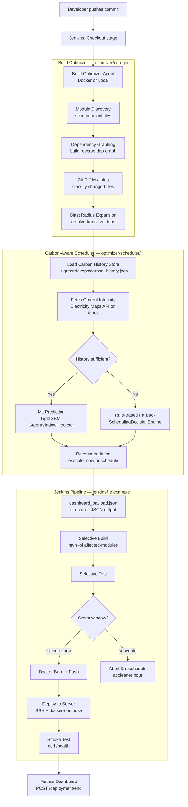

# System Architecture

GreenDevOps is composed of three cooperating subsystems that run inside your Jenkins pipeline on every commit.

---

## Component Overview

### 1. Build Optimizer Agent

The core Python engine (`optimizer/`) that decides *what* to build.

| File | Responsibility |
|---|---|
| `cli.py` | Entry point — parses args, orchestrates the pipeline, emits structured output |
| `core.py` | Module discovery, dependency graphing, impact analysis, blast-radius expansion |
| `config_loader.py` | Loads and validates YAML/JSON config; falls back to built-in defaults |
| `git_utils.py` | Runs `git diff` to retrieve the list of changed files |
| `maven_utils.py` | Constructs `mvn` commands and executes them |

### 2. Carbon-Aware Scheduler

The scheduling subsystem (`optimizer/scheduler/`) that decides *when* to build.

| File | Responsibility |
|---|---|
| `scheduler.py` | Orchestrator — wires all scheduler components together |
| `carbon_api.py` | Electricity Maps API v4 client + mock provider |
| `history_store.py` | Persistent rolling 168-hour carbon intensity cache |
| `predictor.py` | LightGBM model wrapper (`GreenWindowPredictor`) |
| `decision_engine.py` | Threshold-based rule engine used when ML model is unavailable |
| `features.py` | Feature extraction from optimizer output + carbon data |

### 3. Jenkins Pipeline

A declarative `Jenkinsfile` that consumes the optimizer's JSON output to drive the rest of the CI/CD stages.
See [Full Jenkinsfile Walkthrough](../pipeline/full_jenkinsfile.md) for a line-by-line explanation.

### 4. Metrics Dashboard

A lightweight Flask server that receives `POST /deployment/start` and `POST /deployment/end` webhooks and exposes build metrics for the GreenDevOps Dashboard UI.

---

## Data Flow Summary

1. **Commit pushed** → Jenkins pulls the latest code.
2. **Optimizer runs** → Determines the minimal set of Maven modules to build, then calls the scheduler.
3. **Scheduler runs** → Fetches carbon intensity data, runs ML or rule-based prediction, produces a recommendation.
4. **JSON payload emitted** → Parsed by the Jenkinsfile to set environment variables.
5. **Selective build/test** → Only affected modules are compiled and tested.
6. **Deploy or reschedule** → If the grid is green, deploy now. Otherwise abort and reschedule.

---

## Deployment Modes

| Mode | How the optimizer runs | Suitable for |
|---|---|---|
| **Docker** | `docker run beliver247/build-optimizer-agent:latest` | Jenkins agents with Docker available |
| **Local** | `pip install -r requirements.txt && python3 -m optimizer` | Agents without Docker; local development |

Both modes produce identical JSON output. See the [Quick Start Guides](../quick_start_docker.md) for setup instructions.
