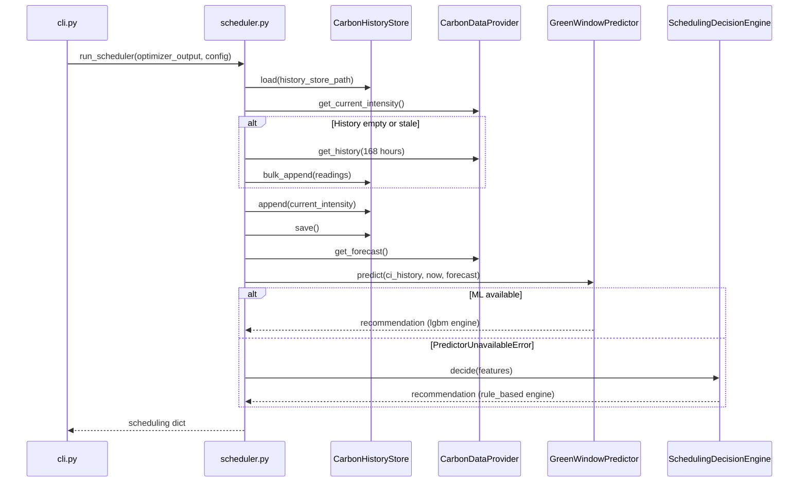

# Carbon-Aware Scheduling

When you pass `--carbon-aware` to the optimizer, a second subsystem runs after the build analysis.
Its job is to decide **when** the deployment should happen based on the real-time carbon intensity of the electricity grid.

---

## The 6-Step Scheduling Pipeline



### Step 1 — Load History Store

On every invocation, the scheduler loads the rolling carbon intensity history from a local JSON file (default: `~/.greendevops/carbon_history.json`).
This file stores timestamped intensity readings going back up to **168 hours** (7 days).

### Step 2 — Fetch & Backfill

The current carbon intensity is fetched from the configured provider.

If the store is **empty or stale** (newest entry older than 2 hours) and `backfill_on_empty: true`, the scheduler automatically fetches the last 168 hours from the API to prime the history buffer.
If the API returns fewer hours than needed (e.g. a free-tier account), the remaining older slots are padded with synthetic mock data to keep the buffer continuous.

### Step 3 — Persist Current Reading

The fresh reading is appended to the history store and the file is saved immediately.

### Step 4 — Fetch 24-Hour Forecast

A 24-hour carbon intensity forecast is fetched from the provider.
This is used by both the ML model and the rule-based engine to find the optimal upcoming hour.

### Step 5 — ML Prediction (Primary Path)

The `GreenWindowPredictor` (a trained LightGBM classifier) is loaded from the bundled model file.
It receives:

- The 168-hour carbon history vector
- The current timestamp
- The 24-hour forecast

It outputs a **`green_probability`** between 0 and 1 — the model's confidence that the current moment is a good (low-carbon) window for deployment.

### Step 6 — Rule-Based Fallback

If the ML model is unavailable (e.g. `scikit-learn` / `lightgbm` not installed, model file missing), a warning is printed and the `SchedulingDecisionEngine` is used instead.
The rule engine applies simple thresholds to the current intensity and the best forecast hour.

---

## Recommendation Output

The scheduler returns a dict that is merged into the top-level `scheduling` key of the optimizer JSON payload:

| Field | Type | Description |
|---|---|---|
| `action` | `string` | `"execute_now"` or `"schedule"` |
| `engine` | `string` | `"lgbm"` or `"rule_based"` |
| `green_probability` | `float` | ML confidence score (0–1). Only present when `engine = "lgbm"`. |
| `current_intensity` | `float` | Carbon intensity at time of decision (gCO₂eq/kWh) |
| `scheduled_hour` | `int \| null` | Target hour (0–23, local time) to reschedule to. `null` when `action = "execute_now"`. |
| `target_intensity` | `float \| null` | Forecasted intensity at `scheduled_hour`. |
| `carbon_history` | `list[{timestamp, intensity}]` | Timestamped history used for the decision (for dashboard display). |
| `carbon_forecast` | `list[{hour, intensity}]` | 24-hour forecast used for the decision. |

**Example — execute now:**
```json
{
  "action": "execute_now",
  "engine": "lgbm",
  "green_probability": 0.83,
  "current_intensity": 148.5,
  "scheduled_hour": null,
  "target_intensity": null
}
```

**Example — reschedule:**
```json
{
  "action": "schedule",
  "engine": "lgbm",
  "green_probability": 0.21,
  "current_intensity": 412.0,
  "scheduled_hour": 3,
  "target_intensity": 95.2
}
```

---

## Carbon Data Providers

### `electricity_maps` (Production)

Uses the [Electricity Maps API v4](https://www.electricitymaps.com/) to fetch real-time and historical carbon intensity data for a specific grid zone.

**Required config:**
```yaml
carbon_aware:
  provider: electricity_maps
  electricity_maps_api_key: YOUR_KEY_HERE
  electricity_maps_zone: LK       # ISO zone code — default is Sri Lanka
```

The API key can also be supplied via the `ELECTRICITY_MAPS_API_KEY` environment variable (takes priority over the config file).

### `mock` (Development / Testing)

Generates synthetic carbon intensity readings using a reproducible random function.
No API key required. Suitable for local development and CI demo pipelines.

```yaml
carbon_aware:
  provider: mock
```

---

## History Store

The history store is a plain JSON file stored locally on the Jenkins agent (or developer machine).

- **Default path:** `~/.greendevops/carbon_history.json`
- **Max entries:** 168 (one per hour, 7 days of history)
- **Stale threshold:** 2 hours — if the newest entry is older than this, the scheduler refetches.
- **Backfill:** Enabled by default (`backfill_on_empty: true`). On first run, the full 168-hour history is pulled from the API automatically.

> [!TIP]
> On agents that run many builds per day, the history store is shared across pipeline runs.
> Make sure the `history_store_path` points to a location that persists between builds (not a workspace directory that gets wiped on checkout).

---

## Using the Scheduling Decision in Your Jenkinsfile

```groovy
def scheduling = result.scheduling

if (scheduling?.action == 'schedule') {
    echo "Grid is dirty (${scheduling.current_intensity} gCO₂eq/kWh). " +
         "Rescheduling for ${scheduling.scheduled_hour}:00 " +
         "(forecast: ${scheduling.target_intensity} gCO₂eq/kWh)."
    // Trigger a delayed Jenkins build, set a cron trigger, etc.
} else {
    echo "Grid is green (probability: ${scheduling?.green_probability}). Deploying now."
    // Continue with Docker build → push → deploy stages
}
```

See the [Full Jenkinsfile Walkthrough](../pipeline/full_jenkinsfile.md) for the complete, production-ready implementation.
