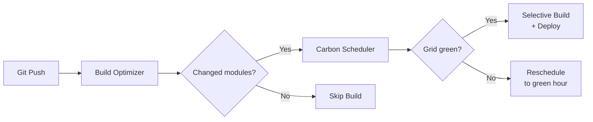

# Welcome to GreenDevOps

GreenDevOps is a next-generation CI/CD framework designed to reduce the carbon footprint of your software delivery lifecycle without compromising on reliability.

## Key Features

- **Intelligent Build Optimization:** Automatically maps Git diffs to your Maven dependencies to selectively build only the affected modules, saving compute time and energy.
- **Carbon-Aware Scheduling:** Predicts the carbon intensity of the grid and intelligently reschedules workloads to greener time windows.
- **Dynamic Deployment Strategy:** Automatically switches between `canary`, `rolling`, or `recreate` deployments based on the risk profile of the commit and real-time carbon data.

## Architecture at a Glance

See [System Architecture](concepts/architecture.md) for the full data-flow diagram.

## Getting Started

To get up and running quickly, check out the Quick Start Guides:

- [Docker Quick Start Guide](quick_start_docker.md) — Recommended for Jenkins pipelines
- [Local Quick Start Guide](quick_start_local.md) — For agents without Docker

## Documentation Map

| Section | What you'll find |
|---|---|
| [Concepts](concepts/architecture.md) | How the system works end-to-end |
| [Configuration](configuration/overview.md) | All config keys, examples, and lookup order |
| [CLI Reference](cli/reference.md) | Flags, exit codes, and output formats |
| [Pipeline](pipeline/full_jenkinsfile.md) | Annotated Jenkinsfile walkthrough and output schema |
| [How It Works](how_it_works.md) | Deep dive into the dependency graph and blast-radius algorithm |
| [Troubleshooting](troubleshooting.md) | Common errors and how to fix them |

